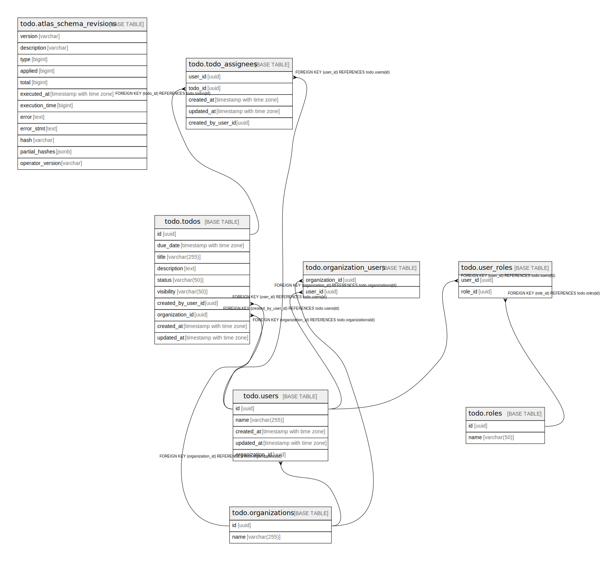

# todo

## Tables

| Name | Columns | Comment | Type |
| ---- | ------- | ------- | ---- |
| [todo.atlas_schema_revisions](todo.atlas_schema_revisions.md) | 12 |  | BASE TABLE |
| [todo.organizations](todo.organizations.md) | 2 |  | BASE TABLE |
| [todo.users](todo.users.md) | 5 |  | BASE TABLE |
| [todo.organization_users](todo.organization_users.md) | 2 |  | BASE TABLE |
| [todo.todos](todo.todos.md) | 10 |  | BASE TABLE |
| [todo.todo_assignees](todo.todo_assignees.md) | 5 |  | BASE TABLE |
| [todo.roles](todo.roles.md) | 2 |  | BASE TABLE |
| [todo.user_roles](todo.user_roles.md) | 2 |  | BASE TABLE |

## Relations

---

> Generated by [tbls](https://github.com/k1LoW/tbls)
