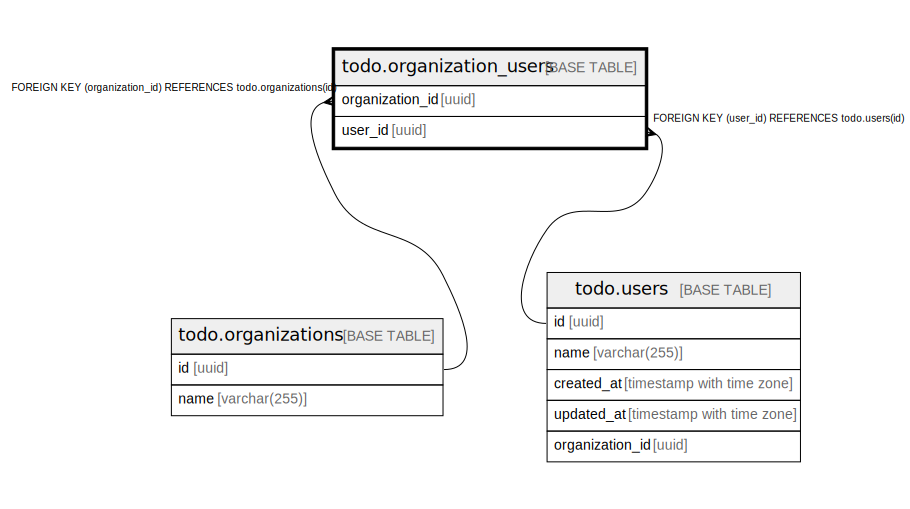

# todo.organization_users

## Description

## Columns

| Name | Type | Default | Nullable | Children | Parents | Comment |
| ---- | ---- | ------- | -------- | -------- | ------- | ------- |
| organization_id | uuid | gen_random_uuid() | false |  | [todo.organizations](todo.organizations.md) |  |
| user_id | uuid | gen_random_uuid() | false |  | [todo.users](todo.users.md) |  |

## Constraints

| Name | Type | Definition |
| ---- | ---- | ---------- |
| fk_organization_users_organization | FOREIGN KEY | FOREIGN KEY (organization_id) REFERENCES todo.organizations(id) |
| fk_organization_users_user | FOREIGN KEY | FOREIGN KEY (user_id) REFERENCES todo.users(id) |
| organization_users_pkey | PRIMARY KEY | PRIMARY KEY (organization_id, user_id) |

## Indexes

| Name | Definition |
| ---- | ---------- |
| organization_users_pkey | CREATE UNIQUE INDEX organization_users_pkey ON todo.organization_users USING btree (organization_id, user_id) |

## Relations

---

> Generated by [tbls](https://github.com/k1LoW/tbls)
