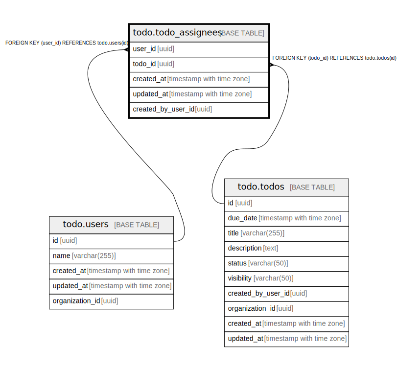

# todo.todo_assignees

## Description

## Columns

| Name | Type | Default | Nullable | Children | Parents | Comment |
| ---- | ---- | ------- | -------- | -------- | ------- | ------- |
| user_id | uuid |  | false |  | [todo.users](todo.users.md) |  |
| todo_id | uuid |  | false |  | [todo.todos](todo.todos.md) |  |
| created_at | timestamp with time zone |  | true |  |  |  |
| updated_at | timestamp with time zone |  | true |  |  |  |
| created_by_user_id | uuid |  | false |  |  |  |

## Constraints

| Name | Type | Definition |
| ---- | ---- | ---------- |
| fk_todo_assignees_user | FOREIGN KEY | FOREIGN KEY (user_id) REFERENCES todo.users(id) |
| fk_todo_assignees_todo | FOREIGN KEY | FOREIGN KEY (todo_id) REFERENCES todo.todos(id) |
| todo_assignees_pkey | PRIMARY KEY | PRIMARY KEY (user_id, todo_id) |

## Indexes

| Name | Definition |
| ---- | ---------- |
| todo_assignees_pkey | CREATE UNIQUE INDEX todo_assignees_pkey ON todo.todo_assignees USING btree (user_id, todo_id) |

## Relations

---

> Generated by [tbls](https://github.com/k1LoW/tbls)
