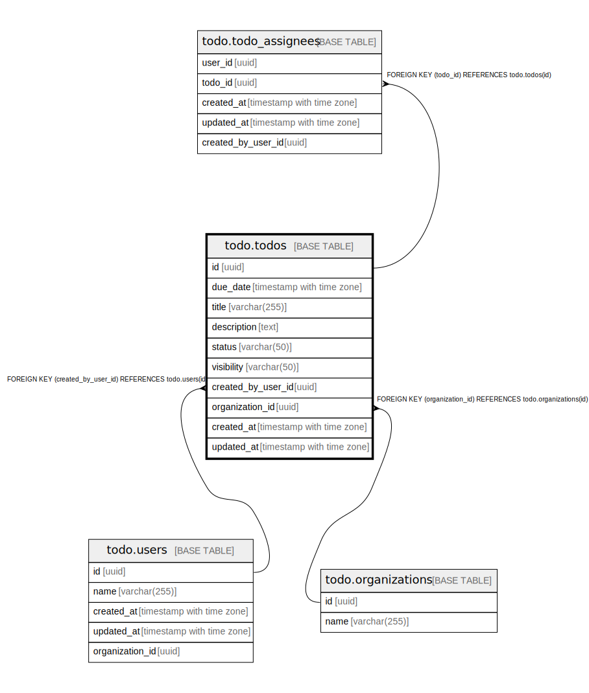

# todo.todos

## Description

## Columns

| Name | Type | Default | Nullable | Children | Parents | Comment |
| ---- | ---- | ------- | -------- | -------- | ------- | ------- |
| id | uuid | gen_random_uuid() | false | [todo.todo_assignees](todo.todo_assignees.md) |  |  |
| due_date | timestamp with time zone |  | true |  |  |  |
| title | varchar(255) |  | false |  |  |  |
| description | text |  | true |  |  |  |
| status | varchar(50) |  | true |  |  |  |
| visibility | varchar(50) |  | false |  |  |  |
| created_by_user_id | uuid |  | false |  | [todo.users](todo.users.md) |  |
| organization_id | uuid |  | false |  | [todo.organizations](todo.organizations.md) |  |
| created_at | timestamp with time zone |  | true |  |  |  |
| updated_at | timestamp with time zone |  | true |  |  |  |

## Constraints

| Name | Type | Definition |
| ---- | ---- | ---------- |
| fk_todos_organization | FOREIGN KEY | FOREIGN KEY (organization_id) REFERENCES todo.organizations(id) |
| fk_users_todos | FOREIGN KEY | FOREIGN KEY (created_by_user_id) REFERENCES todo.users(id) |
| todos_pkey | PRIMARY KEY | PRIMARY KEY (id) |

## Indexes

| Name | Definition |
| ---- | ---------- |
| todos_pkey | CREATE UNIQUE INDEX todos_pkey ON todo.todos USING btree (id) |

## Relations

---

> Generated by [tbls](https://github.com/k1LoW/tbls)
